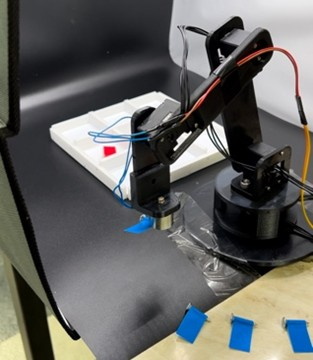
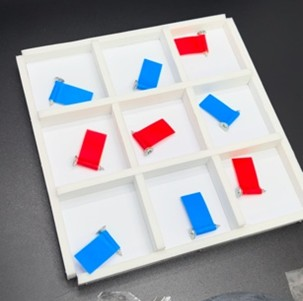
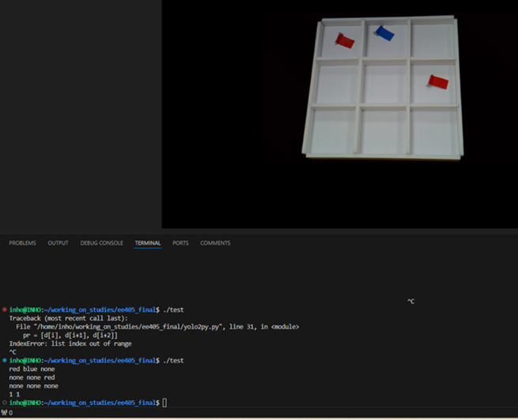

# 🧠 APT: Advanced Player for Tic-Tac-Toe

> A fully autonomous, real-world tic-tac-toe playing robot system based on BeagleBone embedded system, integrating YOLOv5 computer vision, Minimax AI strategy, and precise motor control.

<div align="center">

*Real-time autonomous tic-tac-toe robot combining Vision, Decision Making, Communication, and Control modules*

</div>


<br>

## 📌 Project Overview

APT (Advanced Player for Tic-Tac-Toe) is a comprehensive embedded system developed as the final project for **KAIST EE405 (Embedded System Design)**. This system demonstrates the integration of four critical engineering modules to create a fully autonomous tic-tac-toe playing robot:

- **🎯 Vision**: Real-time object detection using YOLOv5
- **🧠 Decision Making**: Unbeatable strategy with Minimax algorithm
- **🔗 Communication**: NFS-based PC ↔ BeagleBone communication
- **⚙️ Control**: Precise motor control with Dynamixel and P-controller

<div align="center">

<p align="center">
    
    
</p>

<sub>
<b>Left:</b> Custom 3x3 game board with red and blue colored stones.<br>
<b>Right:</b> Dynamixel robotic arm positioning stones during autonomous gameplay.
</sub>

</div>

The robot operates autonomously after a human player places their stone and signals turn completion, handling all subsequent analysis and physical actions independently.


<br>

## 📷 1. Vision Module: Real-time Object Detection

### YOLOv5 Implementation
The vision system serves as the robot's sensory organ, requiring both **reliability** and **speed**. We implemented **YOLOv5 (You Only Look Once v5)**, a CNN-based real-time object detection model that processes images in a single pass to output:

- **Bounding Box Coordinates** (x, y, w, h)
- **Confidence Score** 
- **Class Probability Distribution**

### Technical Specifications
- **Model**: YOLOv5 (Ultralytics)
- **Dataset**: 128 images (100 training / 28 validation)
- **Hardware**: Python3 + NVIDIA RTX 4060 Ti GPU
- **Camera**: Logicam webcam (ceiling-mounted for consistent viewpoint)
- **Accuracy**: 99.8% (validation set)
- **Confidence Threshold**: 0.7
- **Inference Time**: < 1 second

### Controlled Environment Setup
- **Lighting**: Consistent studio lighting within portable box
- **Objects**: Screws with colored paper (red/blue) for high contrast
- **Background**: Controlled studio environment for robust detection
- **Camera Position**: Fixed ceiling mount ensuring stable perspective

<div align="center">



<br>

</div>

The high accuracy is achieved through YOLO's robust characteristics combined with simplified object shapes and consistent background conditions.

<br>


## 🧠 2. Decision Making: Minimax Algorithm Strategy

### Game Theory Foundation
Tic-tac-toe is a **perfect information game** with deterministic outcomes according to **Zermelo's theorem**. Our implementation uses the **Minimax Algorithm** to guarantee optimal play by recursively simulating all possible moves.

### Algorithm Logic
```
Max Node (Robot Turn): Maximize gain
Min Node (Opponent Turn): Assume opponent plays optimally
Depth-First Search: Simulate to game end
Scoring: Win/Draw/Loss evaluation
Backtracking: Select optimal choice
```

### Implementation Details
- **Language**: C++ for high-performance computation
- **State Space**: 3^9 = 19,683 possible positions
- **Search Strategy**: Complete game tree exploration
- **Execution Time**: < 0.5 seconds for move calculation
- **Strategy**: Guaranteed unbeatable (win or draw)

The algorithm ensures the robot never loses by always selecting moves that minimize potential losses in worst-case scenarios.

<br>


## 🔗 3. Communication: NFS-based System Integration

### Hardware Constraint Solution
**Challenge**: BeagleBone Black has only one USB port, occupied by the webcam, preventing traditional I/O methods.

**Solution**: Network File System (NFS) based asynchronous communication.

### Communication Architecture
```
1. PC performs Vision + Decision Making
2. Results written to NFS shared folder as .txt files
3. BeagleBone periodically reads shared files
4. User signals turn completion via SSH terminal
```

### Technical Benefits
- **Simplicity**: Minimal configuration required
- **Reliability**: File-based communication is robust
- **Scalability**: Network-based approach allows system expansion
- **Asynchronous**: Non-blocking operation model
- **Cost-effective**: Utilizes existing network infrastructure

This demonstrates effective embedded networking design using standard protocols for inter-system communication.

<br>


## ⚙️ 4. Control Module: Precision Motor Control

### Hardware Control System
- **Motor**: Dynamixel servo with built-in PID control
- **Controller**: P-type velocity controller (validated in Lab 5)
- **Control Gain**: 4
- **Platform**: BeagleBone Black execution

### P-Controller Advantages
- **Simplicity**: Easy implementation and real-time friendly
- **Responsiveness**: Fast reaction to position errors
- **Reliability**: Minimal parameter tuning required
- **Proven**: Validated through laboratory exercises

### Motion Sequence
1. **Receive coordinates** from vision system
2. **Move gripper** to stone location
3. **Pick up stone** with precise positioning
4. **Transport to target** grid position
5. **Place stone** accurately in designated square

The control system implements a finite state machine approach for reliable sequential operations.

<br>


## 🔩 Hardware Configuration

### Provided Equipment
| Component | Specification |
|-----------|---------------|
| **BeagleBone Black** | Main controller with SD card OS |
| **Logicam Webcam** | USB vision input device |
| **Dynamixel System** | Lab control board and robotic arm |

### Custom Components
| Component | Description |
|-----------|-------------|
| **Portable Studio** | Lighting and background control |
| **Game Board** | Custom 3x3 grid layout |
| **Game Stones** | Screws with colored paper markers |

### System Integration
- **Camera Mount**: Ceiling-fixed for consistent perspective
- **Lighting Control**: Uniform illumination for vision reliability
- **Color Contrast**: High-contrast markers for detection accuracy
- **Workspace**: Controlled environment maximizing recognition performance

<br>


## 🎮 Performance & Results

### Demonstration Metrics
- **Live Demo**: **DRAW** against Teaching Assistant 
- **Test Results**: **100+ games with zero losses** 
- **Decision Speed**: **< 1 second** move calculation 
- **Vision Accuracy**: **99.8%** on validation set 
- **User Experience**: **Minimal interaction** required 

### Technical Performance
```
Vision Processing:    < 1.0s
Minimax Calculation:  < 0.5s  
Motor Movement:       ~3.0s
Total Response:       < 5.0s
Win Rate:            100% (no losses)
System Reliability:   99.8% accuracy
```

These results demonstrate exceptional performance for a real-time control system, showcasing seamless integration of vision, AI, control, and communication subsystems.


<br>

## 📂 Repository Structure
```
EE405_FINAL/
├── py2cpp.cpp              # Python-C++ interface
├── readme.md               # Project documentation  
├── test                    # Test executable
├── tictactoe.cpp           # Minimax algorithm (C++)
├── yolo2py.py              # YOLOv5 inference script
├── ee405_final/
│   ├── board.txt           # Game state file
│   ├── gpio.zip            # GPIO control files
│   ├── memo.txt            # Development notes
│   ├── question.png        # Problem specification
│   ├── test                # Test utilities
│   ├── test.cpp            # C++ test code
│   ├── data/               # Additional datasets
│   └── motor_integration/  # Motor control integration
├── data/                   # Training & Test Data
│   ├── images/
│   │   ├── training/          # 100 training images
│   │   └── validation/        # 28 validation images  
│   ├── labels/
│   │   ├── training.cache     # Training cache
│   │   ├── validation.cache   # Validation cache
│   │   ├── training/          # YOLO format labels
│   │   └── validation/        # YOLO format labels
│   └── test/
│       ├── test1.png          # Test image 1
│       └── test2.png          # Test image 2
└── yolov5/                    # YOLOv5 model files
```

<br>

## 🛠️ Technology Stack

### Core Technologies
- **YOLOv5 (Ultralytics)**: Object detection (Python3)
- **C++**: Minimax algorithm implementation
- **NFS**: Linux network file system
- **Dynamixel SDK**: Motor control interface
- **BeagleBone Black**: Embedded Linux platform

### Development Environment
- **GPU**: NVIDIA RTX 4060 Ti for training
- **OS**: Linux-based embedded system
- **Network**: Ethernet-based NFS communication
- **IDE**: Cross-platform development tools

<br>

## 📚 References & Documentation

- **Redmon et al.**, "You Only Look Once: Real-Time Object Detection", CVPR, 2016
- **Chakole**, "Optimal Strategy for Tic-Tac-Toe using Minimax", 2024
- **Jocher, G.**, "YOLOv5 by Ultralytics", 2020
- **KAIST EE405**: Lab 4 & Lab 5 Practice Materials
- **Zermelo's Theorem**: Game theory foundations for perfect information games

<br>

## 🙏 Acknowledgments

This project was developed under the guidance of **KAIST School of Electrical Engineering EE405** course. We express gratitude to the teaching assistants for providing hardware resources, laboratory access, and technical mentorship throughout the development process.

### 👥 Project Contributors
- **Inho Jung** - [inho9899@kaist.ac.kr](mailto:inho9899@kaist.ac.kr) - *Vision System & Integration*
- **Juho Bae** - [johnbae1901@kaist.ac.kr](mailto:johnbae1901@kaist.ac.kr) - *Control System & Hardware*

---

<div align="center">

### Educational Impact & Significance

*This project demonstrates the real-world integration of artificial intelligence, embedded systems, computer vision, and control engineering. It represents a complete cyber-physical system that showcases the convergence of multiple engineering disciplines in a practical, demonstrable application.*

**🏆 KAIST EE405 Final Project | Fall 2024**

*Achieving seamless integration of Vision → AI → Communication → Control*

</div>

---

## 📸 Technical Gallery

<!-- <details> -->
<!-- <summary>Click to view detailed system images and analysis</summary> -->

### System Components
- **Hardware Setup**: Complete robotic system with Dynamixel arm and ceiling-mounted camera
- **Game Board**: Custom-designed 3x3 grid with precise coordinate mapping  
- **Real-time Interface**: Terminal output showing object detection and game state analysis

### Technical Achievements
- **YOLOv5 Detection**: 99.8% accuracy with sub-second inference times
- **Minimax Strategy**: Mathematically guaranteed unbeatable gameplay
- **System Integration**: Seamless operation across vision, AI, control, and communication
- **Real-time Performance**: Complete move execution in under 5 seconds

### Engineering Excellence
- **Embedded Systems**: Professional-grade BeagleBone implementation
- **Computer Vision**: Production-quality object detection system
- **Game Theory**: Optimal strategic decision making
- **Control Systems**: Precise robotic manipulation and positioning

<!-- </details> -->

---

<div align="center">

*⭐ This project showcases the integration of cutting-edge AI with practical embedded systems engineering*


</div>
